# Join에 대하여

## 조인

조인이란 두개 이상의 테이블을 서로 묶어 하나의 결과 집합 혹은 테이블로 만들어내는것을 의미한다.

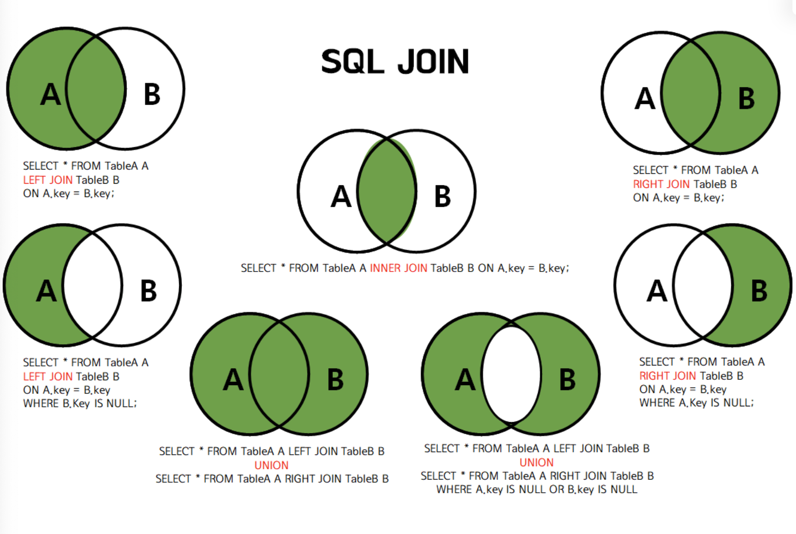

```sql
create database jointest;
use jointest;

// Create table
create table userTBL
(
	userid int AUTO_INCREMENT PRIMARY KEY,
	name VARCHAR(10) NOT NULL,
	residentNumber VARCHAR(30) NOT NULL,
	age INT NOT NULL
);

// Insert Rows
insert into userTBL VALUES(NULL,'a','1234',20);
insert into userTBL VALUES(NULL,'b','5678',21);
insert into userTBL VALUES(NULL,'c','9101112',21);
insert into userTBL VALUES(NULL,'d','13141516',22);

// View table
select * from userTBL;

// FOREIGN KEY table

CREATE TABLE buyTBL
(
	num INT AUTO_INCREMENT PRIMARY KEY,
	userid int NOT NULL,
	prodName CHAR(10) NOT NULL,
	FOREIGN KEY(userid) REFERENCES userTBL(userid)
	ON DELETE CASCADE
	ON UPDATE CASCADE
);
// Insert Rows to Foreign key table 
insert into buyTBL VALUES(NULL,1,'note');
insert into buyTBL VALUES(NULL,1,'pencil');
insert into buyTBL VALUES(NULL,3,'pen');
insert into buyTBL VALUES(NULL,3,'eraser');
insert into buyTBL VALUES(NULL,2, 'keyboard');
insert into buyTBL VALUES(NULL,4,'cup');
```

# Inner Join

일반적인 Join은 Inner Join을 의미한다. 기본적인 형식은 아래 형식을 따른다

```sql
SELECT <열 목록>
FROM <첫번째 테이블>
	INNER JOIN <두번째 테이블>
	ON <조인될 조건>
[WHERE 검색조건]
```

아래 조건에 맞는 쿼리문을 작성해본다

- userTBL과 buyTBL을 Inner Join한다. userid값이 같은것을 Join 조건으로 한다. 검색조건은 생략한다. 이는 사실상 구매한 기록이 있는(`buyTBL` 은 기본적으로 무언가 구매해 테이블에 들어갔다라는 전제조건이므로) 전체 회원을 출력하는것과 동일하다

```sql
SELECT * FROM userTBL INNER JOIN buyTBL ON userTBL.userid = buyTBL.userid;
```

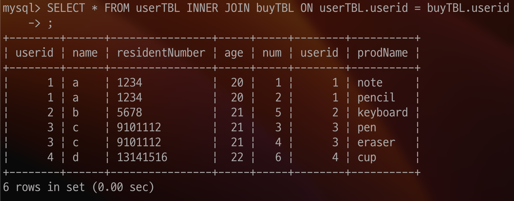

- 위 Join 문에 추가적으로 `[userTBL.nam](http://userTBL.name)e` 의 값이 ‘c’ 인것만 필터링 해본다

```sql
SELECT * FROM userTBL INNER JOIN buyTBL ON userTBL.userid = buyTBL.userid WHERE userTBL.name='c';
```

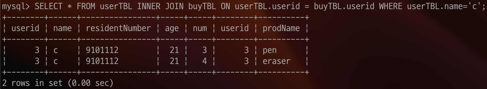

- MySQL 에서 innerjoin은 콤마를 통해 치환할 수 있다. 그리고 `(table).(col)` 형태는 코드가 명확해지지만, 코드가 너무 길어진다.그렇기에, 각각의 테이블 alias를 해줄 수 있다

```sql
SELECT * FROM userTBL u, buyTBL b WHERE u.userid=b.userid and u.name='c';
```

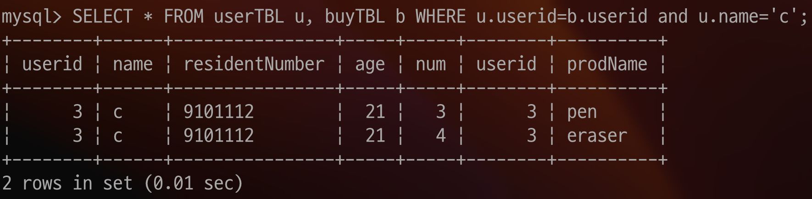

- 여기서 순수히 `userTBL` 에 고객을 몇명 추가해보자

```sql
insert into userTBL VALUES(NULL,'e','1234',20);
insert into userTBL VALUES(NULL,'f','5678',21);
insert into userTBL VALUES(NULL,'g','9101112',21);
insert into userTBL VALUES(NULL,'h','13141516',22);
```

- 이 상태에서 구매한 기록이 있는 고객의 이름, 주민번호를 알고싶다면 다음과 같이 쿼리를 작성할 수 있다. 참고로 `DISTINCT` 는 중복을 방지하는 서브쿼리이다.

```sql
SELECT DISTINCT u.name,u.residentNumber FROM userTBL u INNER JOIN buyTBL b ON u.userid = b.userid;
```

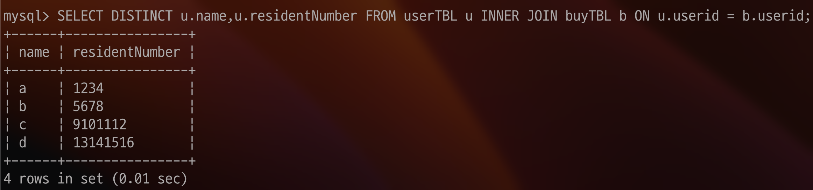

# Outer Join

Outer Join은 Join 조건에 만족되지 않는 행까지 포함시키는 것이다. 형식은 아래와 같다.

```sql
SELECT <열 목록>
FROM <첫번째 테이블(= 왼쪽 테이블)>
	<LEFT | RIGHT | FULL> OUTER JOIN <두번째 테이블(= 오른쪽 테이블)>
		ON <조인 조건>
[WHERE 검색조건]
```

## Left / Right Outer Join

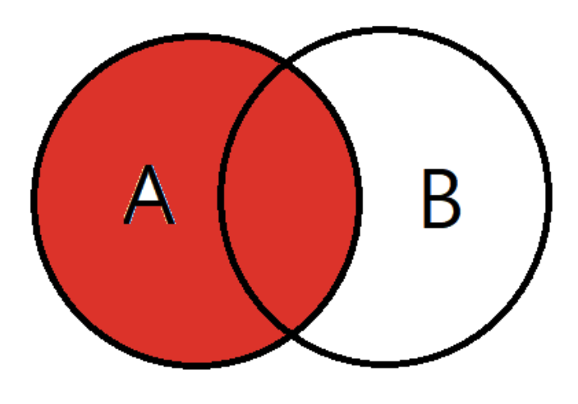

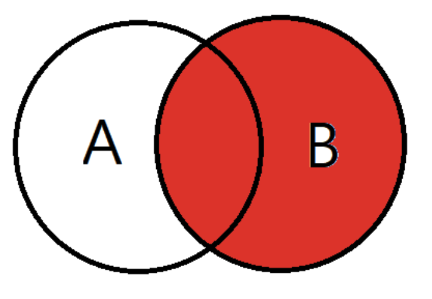

Left Outer Join은 조건에 만족되지 않아도, 왼쪽 테이블의 것은 모두 출력되어야 한다는 것이다. 그냥 줄여서 LEFT JOIN이라고 해도 괜찮다

```sql
SELECT * FROM userTBL u LEFT OUTER JOIN buyTBL b ON u.userid = b.userid;
```

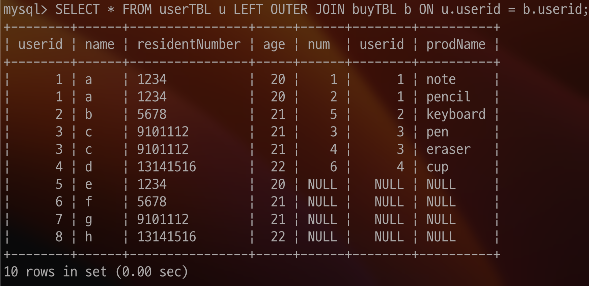

위 사진에서 알 수 있듯이, 왼쪽 테이블인 userTBL에서 해당되지 않는 값들이 모두 출력되는것을 볼 수 있다.

Right Outer Join도 동일하다. userTBL과 buyTBL의 자리를 바꿔 Right Outer Join을 해보자

```sql
SELECT * FROM buyTBL b RIGHT OUTER JOIN userTBL u ON u.userid = b.userid;
```

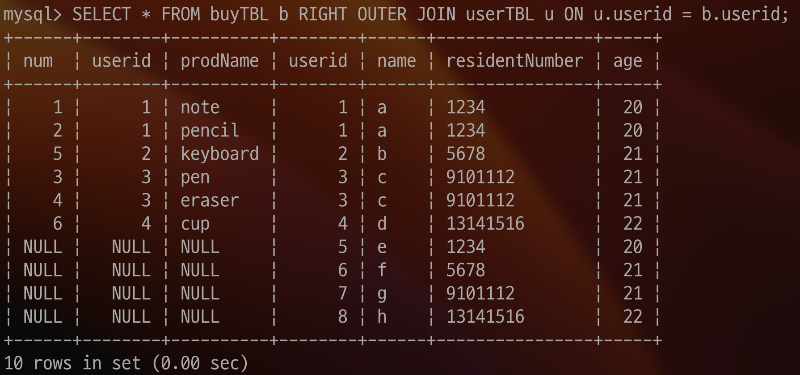

활용 예시로 고객 목록중에 아무런 제품도 산적없는 고객들을 추려낸다고 가정하자

```sql
SELECT u.userid,u.name FROM userTBL u LEFT OUTER JOIN buyTBL b ON u.userid = b.userid WHERE b.prodName IS NULL;
```

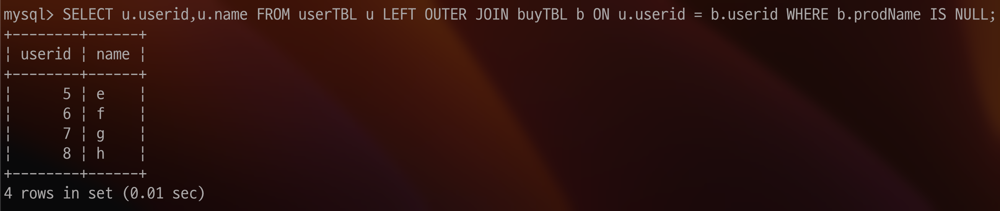

## Full Outer Join

Full Outer Join은 Left Outer Join과 Right Outer Join을 합친것이라고 생각하면 된다. MySQL 에서는 `UNION` 이라는것을 사용하여 Full Outer Join을 한다

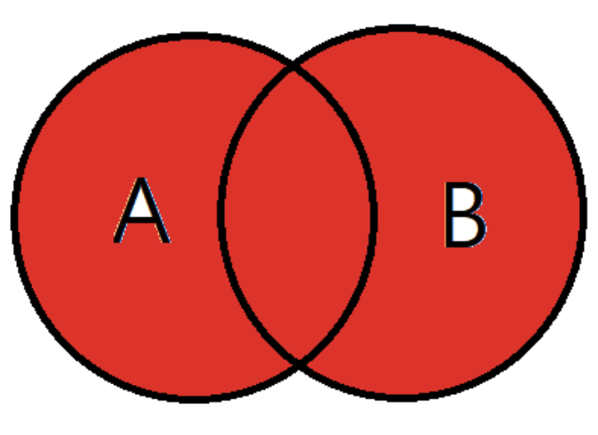

```sql
SELECT * FROM userTBL u LEFT OUTER JOIN buyTBL b ON u.userid = b.userid UNION SELECT * FROM userTBL u RIGHT OUTER JOIN buyTBL b ON u.userid = b.userid;
```

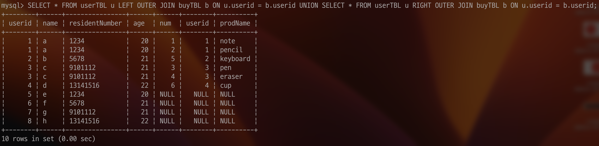

## Cross Join

Cross Join은 한쪽 테이블의 행들과 다른 쪽이 행들을 모두 join 시키는 기능이다. 그렇기에 Cross Join의 결과 개수는 각 테이블의 행 개수를 곱한것과 같다. 형태는 아래와 같다

```sql
SELECT <열 목록>
	FROM <첫번째 테이블>
		CROSS JOIN <두번째 테이블>;
```

위 구문은 사실 아래와 동일하다

```sql
SELECT <열 목록>
	FROM <테이블1>, <테이블2>;
```

주의할 점은 Cross Join에서는 ON구문을 사용할 수 없다는 점이다. Cross Join은 순수히 테스트 용도로 생성할 데이터를 만들때 사용하는것이 좋다.

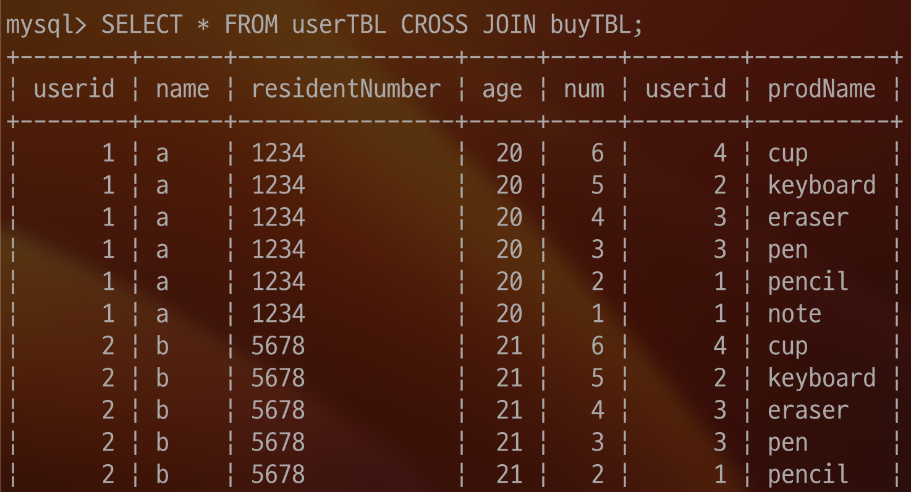