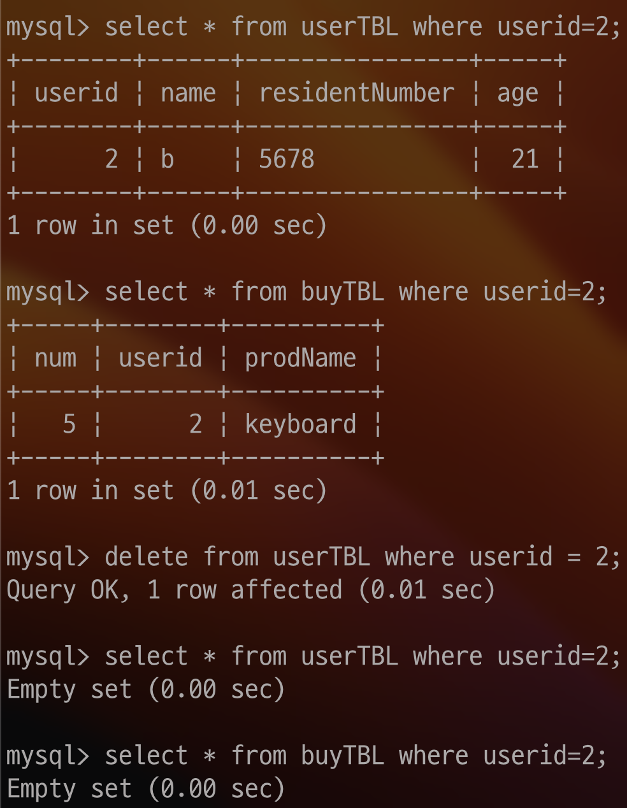
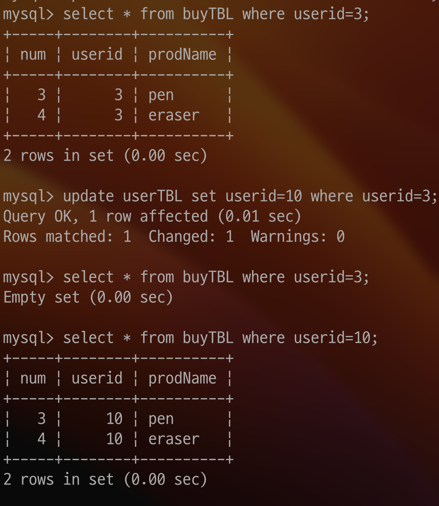

# Key에 대해서

## Database : Key

Key란 데이터베이스에서 조건에 만족하는 튜플을 찾거나 순서대로 정렬할때 다른 튜플들과 구별할 수 있는 유일한 기준이 되는 속성이다.

→ 튜플이란 : 쉽게 말해 행을 의미한다.

```sql
// Create table
create table userTBL
(
	userid int AUTO_INCREMENT PRIMARY KEY,
	name VARCHAR(10) NOT NULL,
	residentNumber VARCHAR(30) NOT NULL,
	age INT NOT NULL
);

// Insert Rows
insert into userTBL VALUES(NULL,'a','1234',20);
insert into userTBL VALUES(NULL,'b','5678',21);
insert into userTBL VALUES(NULL,'c','9101112',21);
insert into userTBL VALUES(NULL,'d','13141516',22);

// View table
select * from userTBL;

// FOREIGN KEY table

CREATE TABLE buyTBL
(
	num INT AUTO_INCREMENT PRIMARY KEY,
	userid int NOT NULL,
	prodName CHAR(10) NOT NULL,
	FOREIGN KEY(userid) REFERENCES userTBL(userid)
	ON DELETE CASCADE
	ON UPDATE CASCADE
);
// Insert Rows to Foreign key table 
insert into buyTBL VALUES(NULL,1,'note');
insert into buyTBL VALUES(NULL,1,'pencil');
insert into buyTBL VALUES(NULL,3,'pen');
insert into buyTBL VALUES(NULL,3,'eraser');
insert into buyTBL VALUES(NULL,2, 'keyboard');
insert into buyTBL VALUES(NULL,4,'cup');

// Check before update
select * from buyTBL where userid=3;

// ON UPDATE CASCADE
update userTBL set userid=10 where userid=3;

// Check after update
select * from buyTBL where userid=3;

// Check after update userid is 10
select * from buyTBL where userid=10;

// Check userid is 2 in buyTBL, userTBL
select * from userTBL where userid=2;
select * from buyTBL where userid=2;

// Delete where userid is 2
delete from userTBL where userid = 2;

// Check userid is 2 in buyTBL, userTBL
select * from userTBL where userid=2;
select * from buyTBL where userid=2;
```

### Key의 종류

1. 후보키
    - 튜플을 유일하게 실별할 수 있는 속성들의 부분집합이다.
    - 유일성과 최소성을 만족하는 키로서, Primary Key가 될 수 있는 후보이기에 후보키라 부른다
        - 유일성 : 튜플을 식별할수 있는지의 여부
        - 최소성 : 꼭 필요한 속성으로만 구성
2. 기본키
    - 후보키중 선택된 키이며, Null이 될 수 없으며, Unique Value로 구성되어야 한다.
3. 대체키
    - 후보키 중 기본키를 제외한 나머지 후보키
4. 슈퍼키
    - 유일성은 만족할 수 있다
    - 최소성은 만족할 수 없다
    - 위 예시에서 `userid` + `residentNumber` 를 합쳐서 슈퍼키로 만들수도, `userid` + `residentNumber` + `age` 를 합쳐 슈퍼키로 만들 수 도 있다. 중요한것은, 중복된 값만 안나오고, 구별 가능하면 된다는것이다.

1. 외래키
    - 다른 릴레이션의 기본키를 그대로 참조하는 속성의 집합이다
    - 외래키 관계를 설정하면, 하나의 테이블이 다른 테이블에 의존하게 된다.
    - 외래키 테이블에 데이터를 입력할 때는 꼭 기준 테이블을 참조해서 입력한다. 그렇기에 기준 테이블에 이미 참조하고 있는 데이터가 존재해야한다.
    - 의존관계이기에, 테이블 삭제시 자식 테이블을 삭제하고 부모 테이블을 삭제해야한다.
    - 외래키가 설정되는 전제조건은, `Primary Key` 이거나 `Unique Key` 이어야 한다는 점이 있다.
    - 외래키를 생성하는 방법은 `CREATE TABLE` 끝에 `FOREIGN KEY` 키워드로 설정하는 방법이 있다.
    - 간단하게 외래키의 이름을 지정하려면 아래와 같이 문을 작성하면 된다
        
        ```sql
        FOREIGN KEY(col name) REFERENCES <reference table>(reference table's col name)
        ```
        
    - 만약 외래키 제약조건의 이름을 지정해야한다면 아래와 같이 지정할 수 있다
        
        ```sql
        CONSTRAINT (constraint name) FOREIGN KEY(col name) REFERENCES <reference table>(reference table's col name)
        ```
        
    
    ### ON UPDATE CASCADE, ON DELETE CASCADE
    
    위 두 옵션은 기준 테이블의 데이터가 변경되었을때 외래키 테이블도 자동으로 적용되도록 설정해준다. 두 옵션 모두 별도로 지정하지 않으면 `ON UPDATE NO ACTION`, `ON DELETE NO ACTION` 과 동일한 효과이다.
    
    - ON UPDATE CASCADE
        - 처음에 `buyTBL` 에서 `userid` 가 3인 목록들을 출력한다
        - `buyTBL.userid` 는 `userTBL.userid` 와 연결되어있다는걸 상기시킨다. `userTBL.userid` 가 3인값들을 10으로 바꿔준다.
        - 그 후 `buyTBL` 에서 `userid` 가 3인 목록들을 출력한다. 아무것도 없음을 알 수 있으며, `buyTBL` 에서 `userid` 가 10인 목록들을 출력했을때 위에서 봤던 행들이 그대로 변경된것을 볼 수 있다.
        
        
        
    - ON DELETE CASCADE
        - `userTBL.userid` 값이 2인 튜플을 모두 제거한다
        - 우선, `userTBL`, `buyTBL` 에서 `userid` 가 2인 모든 튜플을 출력해본다.
        - `userTBL` 에서 `userid` 가 2인 모든 튜플을 지우도록 쿼리를 작성한다
        - `userTBL`, `buyTBL` 에서 `userid` 가 2인 모든 튜플을 출력해본다.
        
        
        
2. Unique Key
    - 중복되지 않는 유일한 값을 입력해야하는 조건이다. Primary Key와 동일하지만, Nullable 하다는 차이점이있다.
    - 테이블 생성시 `UNIQUE` 키워드를 붙이면 된다